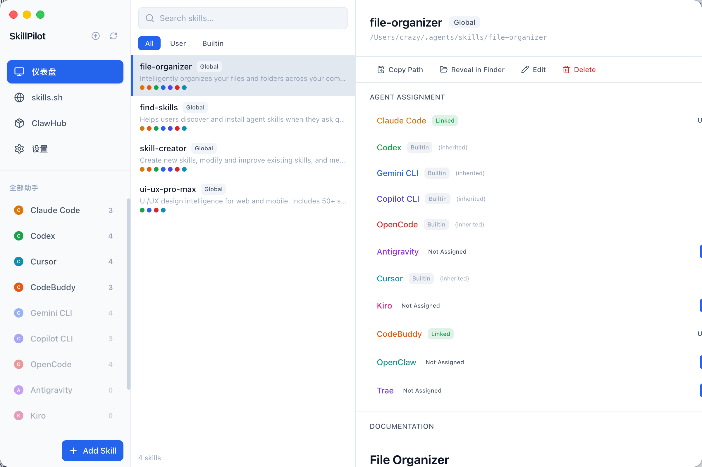
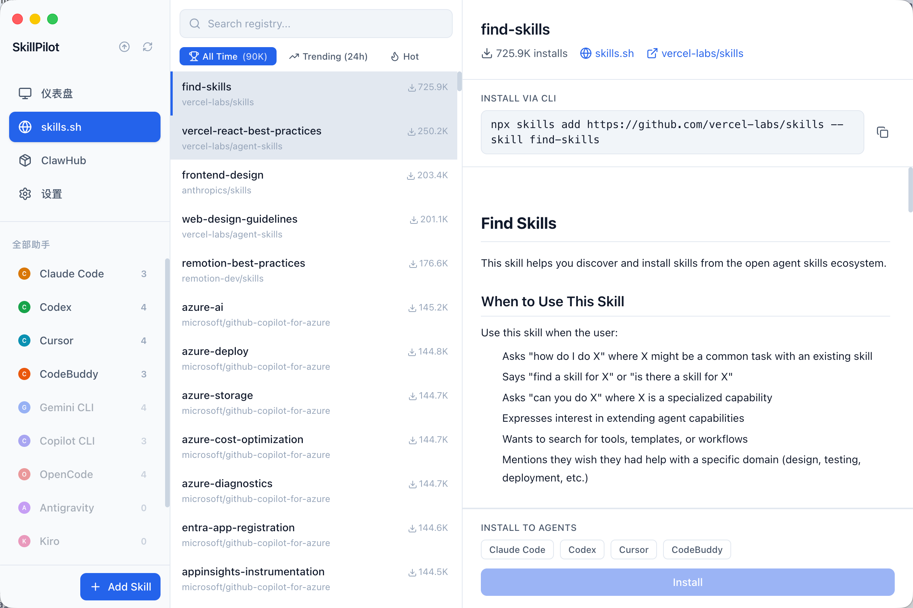
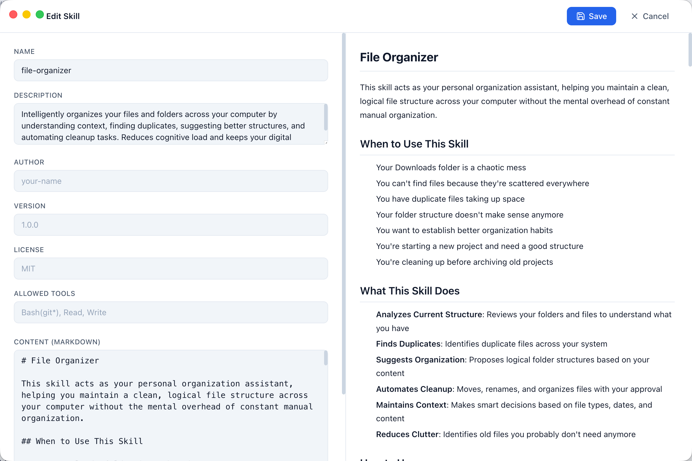
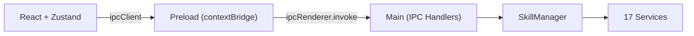

# SkillPilot

*The desktop app for managing AI code agent skills.*

[](https://github.com/CrazyGang97/skillpilot/actions/workflows/ci.yml)
[](https://www.electronjs.org/)
[](https://www.typescriptlang.org/)
[](LICENSE)

---

**SkillPilot** is a desktop GUI for managing skills across multiple AI code agents — [Claude Code](https://docs.anthropic.com/en/docs/claude-code), [Codex](https://github.com/openai/codex), [Gemini CLI](https://github.com/google-gemini/gemini-cli), [Copilot CLI](https://docs.github.com/en/copilot/using-github-copilot/using-github-copilot-in-the-command-line), [OpenCode](https://opencode.ai), [Antigravity](https://antigravity.google), [Cursor](https://cursor.com), [Kiro](https://kiro.dev), [CodeBuddy](https://www.codebuddy.ai), [OpenClaw](https://openclaw.ai), and [Trae](https://www.trae.ai). No more manual file editing, symlink juggling, or YAML parsing by hand.

## Screenshots







## Features

- **Multi-Agent Support** — Manage skills for 11 AI code agents from a single unified interface
- **Registry Browser** — Browse the [skills.sh](https://skills.sh) leaderboard with search and category filters
- **Unified Dashboard** — View all skills and agents at a glance with per-agent filtering
- **Flexible Imports** — Install from GitHub or import from a local folder containing `SKILL.md`, then auto-create symlinks and update the lock file
- **Per-Skill Update Detection** — Detect remote changes via Git tree hash comparison and pull updates with one click
- **Batch Update Check** — Check all GitHub-sourced skills for updates in one action
- **SKILL.md Editor** — Split-pane form + markdown editor with live preview
- **Agent Assignment** — Toggle which agents a skill is installed to via symlink management
- **Proxy Support** — HTTPS / SOCKS5 proxy with macOS Keychain-backed password storage
- **Localization** — Full English and Simplified Chinese interface with in-app switching
- **Auto-Refresh** — File system monitoring picks up CLI-side changes instantly

## Requirements

- **macOS** 13 (Ventura) or later
- **Node.js** 20+ and **pnpm** (for building from source only)

## Installation

### Download (Recommended)

Download the latest `.dmg` or `.zip` from [GitHub Releases](https://github.com/CrazyGang97/skillpilot/releases):

1. Download `SkillPilot-vX.Y.Z.dmg`
2. Open the `.dmg` and drag `SkillPilot.app` to `/Applications/`
3. On first launch, macOS may block unsigned apps. To open:
   ```bash
   xattr -cr /Applications/SkillPilot.app
   ```
   Or: Right-click the app → Open → click "Open" in the dialog.

### Build from Source

Requires Node.js 20+ and pnpm.

```bash
git clone https://github.com/CrazyGang97/skillpilot.git
cd skillpilot
pnpm install
pnpm build:mac
```

The built app will be in the `release/` directory.

## Supported Agents

| Agent | Skills Directory | Detection | Skills Reading Priority |
|-------|-----------------|-----------|------------------------|
| [Claude Code](https://docs.anthropic.com/en/docs/claude-code) | `~/.claude/skills/` | `claude` binary | Own directory only |
| [Codex](https://github.com/openai/codex) | `~/.codex/skills/` | `codex` binary | Own → `~/.agents/skills/` |
| [Gemini CLI](https://github.com/google-gemini/gemini-cli) | `~/.gemini/skills/` | `gemini` binary | Own → `~/.agents/skills/` |
| [Copilot CLI](https://docs.github.com/en/copilot/using-github-copilot/using-github-copilot-in-the-command-line) | `~/.copilot/skills/` | `gh` binary | Own → `~/.claude/skills/` |
| [OpenCode](https://opencode.ai) | `~/.config/opencode/skills/` | `opencode` binary | Own → `~/.claude/skills/` → `~/.agents/skills/` |
| [Antigravity](https://antigravity.google) | `~/.gemini/antigravity/skills/` | `antigravity` binary | Own directory only |
| [Cursor](https://cursor.com) | `~/.cursor/skills/` | `cursor` binary | Own → `~/.claude/skills/` → `~/.agents/skills/` |
| [Kiro](https://kiro.dev) | `~/.kiro/skills/` | `kiro` binary | Own directory only |
| [CodeBuddy](https://www.codebuddy.ai) | `~/.codebuddy/skills/` | `codebuddy` binary | Own directory only |
| [OpenClaw](https://openclaw.ai) | `~/.openclaw/skills/` | `openclaw` binary | Own directory only |
| [Trae](https://www.trae.ai) | `~/.trae/skills/` | `trae` binary | Own directory only |

## Tech Stack

| Layer | Technology |
|-------|-----------|
| Desktop | Electron 41 |
| Frontend | React 19 + TypeScript 5.9 |
| Build | Vite 8 |
| Styling | Tailwind CSS 4 |
| State | Zustand + React Query |
| i18n | i18next |
| Testing | Vitest + Playwright |

## Architecture

SkillPilot uses a central orchestrator pattern. The `SkillManager` composes 17 specialized service modules. The renderer communicates with the main process through a type-safe 4-layer IPC bridge.



Key design decisions:
- **Filesystem is the database** — skills are directories containing `SKILL.md` files
- **Zustand** for UI state, **React Query** for server/async data
- **Atomic file writes** — write to `.tmp` then `fs.renameSync()` to prevent corruption

## Development

```bash
pnpm install          # Install dependencies
pnpm dev              # Start dev server + Electron
pnpm test             # Run unit tests (Vitest)
pnpm test:e2e         # Run E2E tests (Playwright)
pnpm build:mac        # Build macOS app
pnpm typecheck        # Type-check renderer + main process
```

## Troubleshooting

| Problem | Solution |
|---------|----------|
| macOS blocks the app on first launch | Run `xattr -cr /Applications/SkillPilot.app` or right-click → Open → click "Open" |
| Agent not detected | Ensure the agent CLI is installed and available in `$PATH` |
| Skills not syncing after CLI changes | Click the refresh button in the sidebar, or check that the skills directory exists |
| GitHub imports fail behind a proxy | Configure proxy in Settings → Proxy. Proxy passwords are stored in the macOS Keychain. |
| Local import fails | Local import only supports directories containing `SKILL.md`, and symlinks inside the imported directory tree are rejected. |
| Update check cannot determine status | Update checks only support GitHub-backed skills. Older installs with no saved baseline may report that the local hash is unknown until they are re-baselined by reinstalling or updating. |

## Contributing

1. Fork the repository
2. Create a feature branch (`git checkout -b feat/my-feature`)
3. Run tests (`pnpm test`)
4. Open a Pull Request

## License

[MIT](LICENSE)

## Star History

<a href="https://star-history.com/#CrazyGang97/skillpilot&Date">
 <picture>
   <source media="(prefers-color-scheme: dark)" srcset="https://api.star-history.com/svg?repos=CrazyGang97/skillpilot&type=Date&theme=dark" />
   <source media="(prefers-color-scheme: light)" srcset="https://api.star-history.com/svg?repos=CrazyGang97/skillpilot&type=Date" />
   
 </picture>
</a>
